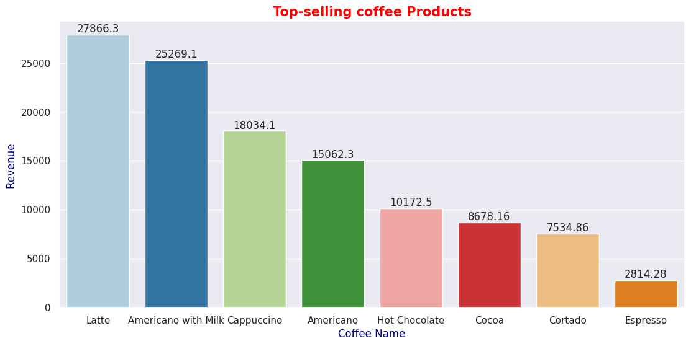
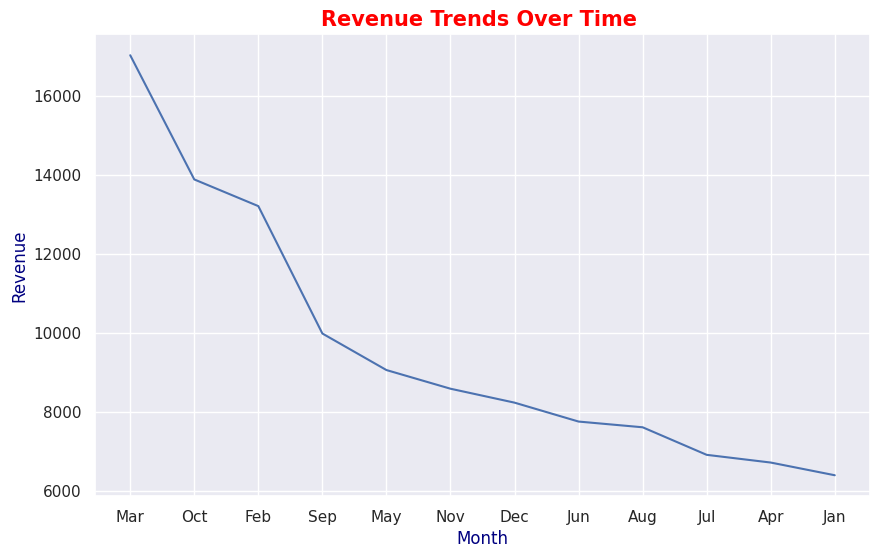
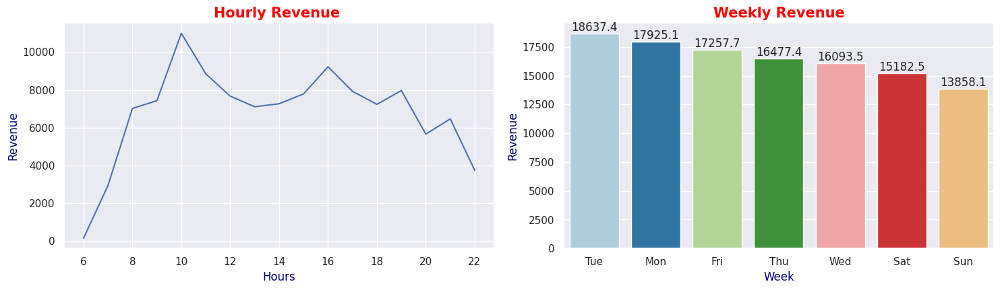

# Coffee-Sales-EDA-Project

## 📋 Objective
The goal of this project is to analyze coffee shop sales data and uncover key insights related to:
- Top-selling coffee products  
- Revenue growth trends  
- Customer purchase behavior  
- Payment preferences (Cash vs Card)  
- Peak sales hours and weekdays  

---

## 🧹 Data Cleaning
- Removed unnecessary columns and converted `Date` to proper datetime format.  
- Handled missing values (e.g., replaced null values in `Card` with **“Unknown”**).  
- Checked for duplicates and ensured all numeric columns were in the correct format.  
- Verified that there were no outliers impacting key revenue metrics.

---

## 📊 Exploratory Data Analysis
- **Top-Selling Products:** *Latte* and *Americano with Milk* generated the highest revenue, together contributing nearly 46% of total sales.  
- **Revenue Trends:** Revenue increased by **166%** from January to March, showing strong business growth.  
- **Payment Analysis:** **97.55%** of customers prefer **card transactions**, highlighting a shift toward digital payments.  
- **Customer Frequency:** A few customers make repeated purchases, showing strong brand loyalty.  
- **Peak Hours & Days:** Maximum sales occur between **8–10 AM** and on **Tuesdays**, while the lowest occur at **6 AM** and on **Sundays**.

---

## 💡 Key Business Insights
- Increase production of **Latte** and **Americano with Milk** as they are most preferred by customers.  
- Focus more staff and inventory between **8–10 AM**, when customer traffic is highest.  
- Promote **special weekday offers** (especially on Tuesdays) to boost revenue.  
- Encourage **digital payments** through loyalty rewards or discount campaigns.  

---

## 📊 Visual Insights

### ☕ Top-Selling Coffee Products

### 📈 Revenue Growth (Jan–Mar)

### ⏰ Peak Sales Hours & Days

